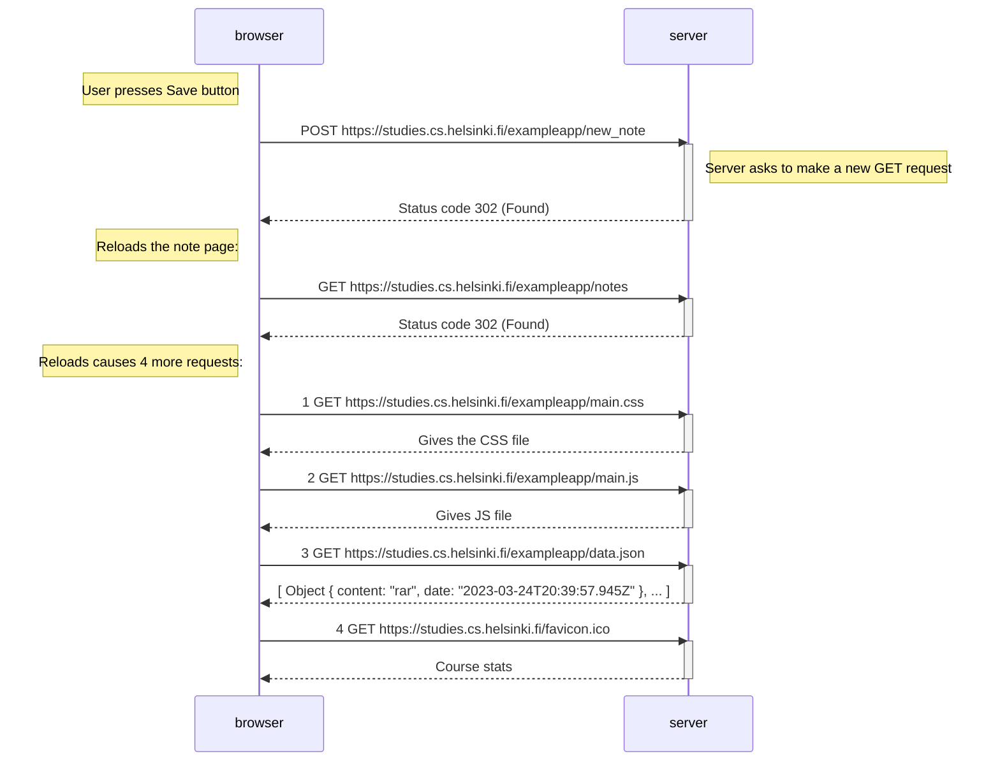

```mermaid
sequenceDiagram
    participant browser
    participant server

    Note left of browser: User presses Save button

    browser->>server: POST https://studies.cs.helsinki.fi/exampleapp/new_note
    activate server
    Note right of server: Server asks to make a new GET request
    server-->>browser: Status code 302 (Found)
    deactivate server

     Note left of browser: Reloads the note page:

    browser->>server: GET https://studies.cs.helsinki.fi/exampleapp/notes
    activate server
    server-->>browser: Status code 302 (Found)
    deactivate server

    Note left of browser: Reloads causes 4 more requests:
    browser->>server: 1 GET https://studies.cs.helsinki.fi/exampleapp/main.css
    activate server
    server-->>browser: Gives the CSS file
    deactivate server

    browser->>server: 2 GET https://studies.cs.helsinki.fi/exampleapp/main.js
    activate server
    server-->>browser: Gives JS file
    deactivate server

    browser->>server: 3 GET https://studies.cs.helsinki.fi/exampleapp/data.json
    activate server
    server-->>browser: [ Object { content: "rar", date: "2023-03-24T20:39:57.945Z" }, ... ]
    deactivate server

    browser->>server: 4 GET https://studies.cs.helsinki.fi/favicon.ico
    activate server
    server-->>browser: Course stats
    deactivate server
```
