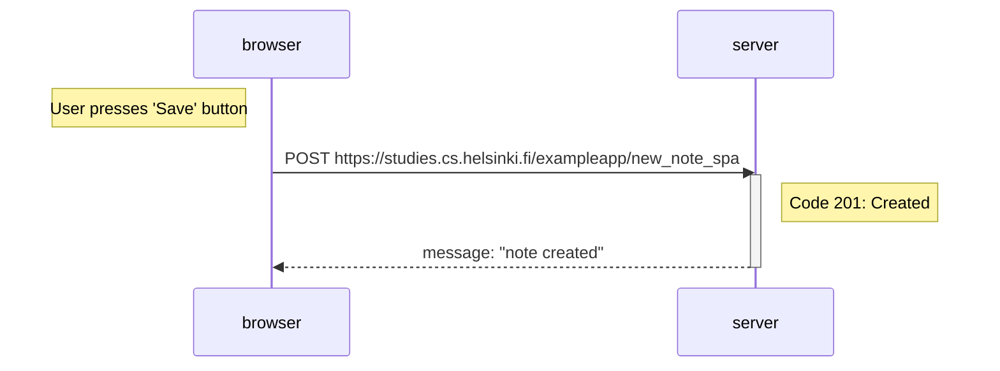

```mermaid
sequenceDiagram
    participant browser
    participant server

    Note left of browser: User presses 'Save' button

    browser->>server: POST https://studies.cs.helsinki.fi/exampleapp/new_note_spa
    activate server
    Note right of server: Code 201: Created
    server-->>browser: message: "note created"
    deactivate server


```
